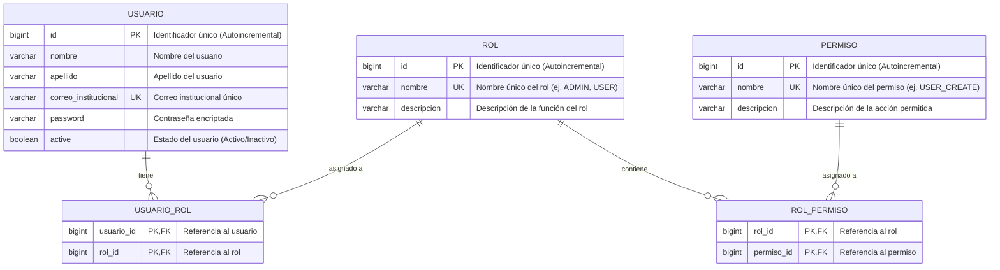

# Diagrama Entidad-Relación: Control de Acceso Basado en Roles (RBAC)

Este documento contiene el modelo Entidad-Relación (ER) para la gestión de usuarios, roles y permisos bajo un esquematizado **RBAC (Role-Based Access Control)**, alineado con la base de datos y la arquitectura del sistema.

---

## 1. Diagrama Entidad-Relación (Mermaid)



---

## 2. Descripción de Entidades y Atributos

### Entidad `USUARIO`
Representa a los usuarios registrados dentro del sistema.

| Atributo | Tipo de Dato | Restricciones | Descripción |
| :--- | :--- | :--- | :--- |
| `id` | `BIGINT` | **PK**, Not Null, Auto-increment | Identificador único del usuario. |
| `nombre` | `VARCHAR(100)` | Not Null | Nombre(s) del usuario. |
| `apellido` | `VARCHAR(100)` | Not Null | Apellido(s) del usuario. |
| `correo_institucional` | `VARCHAR(50)` | **UK**, Not Null | Correo institucional único de acceso. |
| `password` | `VARCHAR(255)` | Not Null | Contraseña almacenada de forma segura (hash). |
| `active` | `BOOLEAN` | Not Null | Indica si la cuenta se encuentra activa o suspendida. |

---

### Entidad `ROL`
Representa los roles de perfilamiento asignables dentro del sistema.

| Atributo | Tipo de Dato | Restricciones | Descripción |
| :--- | :--- | :--- | :--- |
| `id` | `BIGINT` | **PK**, Not Null, Auto-increment | Identificador único del rol. |
| `nombre` | `VARCHAR(50)` | **UK**, Not Null | Nombre único del rol (p. ej. `ADMIN`, `DOCENTE`, `ESTUDIANTE`). |
| `descripcion` | `VARCHAR(255)` | Nullable | Descripción detallada de las responsabilidades del rol. |

---

### Entidad `PERMISO`
Representa las acciones o privilegios atómicos que se pueden ejecutar dentro de la aplicación.

| Atributo | Tipo de Dato | Restricciones | Descripción |
| :--- | :--- | :--- | :--- |
| `id` | `BIGINT` | **PK**, Not Null, Auto-increment | Identificador único del permiso. |
| `nombre` | `VARCHAR(100)` | **UK**, Not Null | Nombre único del permiso (p. ej. `USER_CREATE`, `USER_READ`). |
| `descripcion` | `VARCHAR(255)` | Nullable | Descripción de la operación o funcionalidad autorizada. |

---

### Tabla Intermedia `USUARIO_ROL`
Tabla pivote para resolver la relación **Muchos a Muchos (N:M)** entre `USUARIO` y `ROL`.

| Atributo | Tipo de Dato | Restricciones | Descripción |
| :--- | :--- | :--- | :--- |
| `usuario_id` | `BIGINT` | **PK**, **FK**, Not Null | Clave foránea que referencia a `USUARIO(id)`. |
| `rol_id` | `BIGINT` | **PK**, **FK**, Not Null | Clave foránea que referencia a `ROL(id)`. |

---

### Tabla Intermedia `ROL_PERMISO`
Tabla pivote para resolver la relación **Muchos a Muchos (N:M)** entre `ROL` y `PERMISO`.

| Atributo | Tipo de Dato | Restricciones | Descripción |
| :--- | :--- | :--- | :--- |
| `rol_id` | `BIGINT` | **PK**, **FK**, Not Null | Clave foránea que referencia a `ROL(id)`. |
| `permiso_id` | `BIGINT` | **PK**, **FK**, Not Null | Clave foránea que referencia a `PERMISO(id)`. |

---

## 3. Cardinalidad y Reglas de Negocio

### Relaciones y Cardinalidad
1. **`USUARIO` ↔ `ROL` (Muchos a Muchos - N:M):**
   - **Usuario -> Rol (`0..N`):** Un usuario puede poseer cero, uno o múltiples roles.
   - **Rol -> Usuario (`0..N`):** Un rol puede estar asignado a cero, uno o múltiples usuarios.
   - **Implementación:** Se gestiona a través de la tabla de unión `USUARIO_ROL`.

2. **`ROL` ↔ `PERMISO` (Muchos a Muchos - N:M):**
   - **Rol -> Permiso (`0..N`):** Un rol puede agrupar cero, uno o múltiples permisos.
   - **Permiso -> Rol (`0..N`):** Un permiso puede estar contenido en cero, uno o múltiples roles.
   - **Implementación:** Se gestiona a través de la tabla de unión `ROL_PERMISO`.

---

### Jerarquía Conceptual (RBAC)

La asignación de accesos sigue un flujo jerárquico desacoplado:

```text
USUARIO  ──▶  USUARIO_ROL  ──▶  ROL  ──▶  ROL_PERMISO  ──▶  PERMISO
```

#### Ejemplo Práctico de Jerarquía:
```text
Juan (USUARIO)
  └── ADMIN (ROL)
        ├── USER_CREATE (PERMISO)
        ├── USER_READ (PERMISO)
        ├── USER_UPDATE (PERMISO)
        └── USER_DELETE (PERMISO)
```

---

### Leyenda de Notación y Simbología

| Símbolo / Acrónimo | Significado | Descripción |
| :--- | :--- | :--- |
| `||` | Exactamente uno | Cardinalidad obligatoria de un solo elemento. |
| `o{` | Cero o muchos | Cardinalidad opcional múltiple. |
| **PK** | *Primary Key* | Clave primaria identificadora de la entidad. |
| **FK** | *Foreign Key* | Clave foránea referencial. |
| **UK** | *Unique Key* | Restricción de valor único en la columna. |