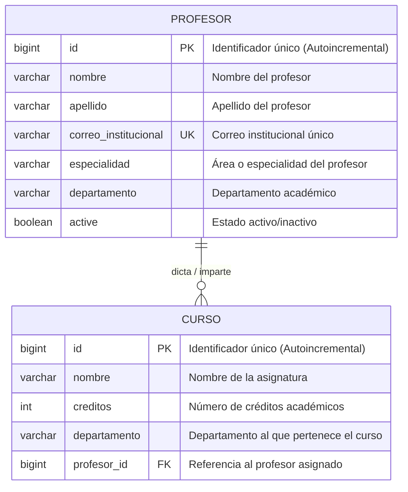

# Diagrama Entidad-Relación: Curso y Profesor

Este documento contiene el modelo Entidad-Relación (ER) entre las entidades **Profesor** y **Curso**, alineado con la base de datos y los modelos del proyecto.

---

## 1. Diagrama Entidad-Relación (Mermaid)

---

## 2. Descripción de Entidades y Atributos

### 🧑‍🏫 Entidad `PROFESOR`
Representa al docente encargado de impartir cursos académicos.

| Atributo | Tipo de Dato | Restricciones | Descripción |
| :--- | :--- | :--- | :--- |
| `id` | `BIGINT` | **PK**, Not Null, Auto-increment | Identificador único del profesor. |
| `nombre` | `VARCHAR` | Not Null | Nombre(s) del profesor. |
| `apellido` | `VARCHAR` | Not Null | Apellido(s) del profesor. |
| `correo_institucional`| `VARCHAR(50)` | **UK**, Not Null | Correo institucional único. |
| `especialidad` | `VARCHAR` | Not Null | Área de especialidad (p.ej. Desarrollo de software). |
| `departamento` | `VARCHAR` | Not Null | Departamento académico al que pertenece. |
| `active` | `BOOLEAN` | Not Null | Indica si el docente se encuentra activo. |

---

### 📚 Entidad `CURSO`
Representa una materia o asignatura académica ofertada.

| Atributo | Tipo de Dato | Restricciones | Descripción |
| :--- | :--- | :--- | :--- |
| `id` | `BIGINT` | **PK**, Not Null, Auto-increment | Identificador único del curso. |
| `nombre` | `VARCHAR` | Not Null | Nombre de la asignatura. |
| `creditos` | `INT` | Not Null | Cantidad de créditos académicos. |
| `departamento` | `VARCHAR` | Not Null | Departamento académico asociado. |
| `profesor_id` | `BIGINT` | **FK**, Not Null | Clave foránea que referencia a `PROFESOR(id)`. |

---

## 3. Cardinalidad y Reglas de Negocio

- **Relación `1:N` (Uno a Muchos):**
  - **Profesor -> Curso (`0..N`):** Un profesor puede tener asignados cero, uno o varios cursos a su cargo.
  - **Curso -> Profesor (`1..1`):** Cada curso pertenece y está asignado obligatoriamente a exactamente un profesor (`nullable = false`).
- **Integridad Referencial:**
  - `CURSO.profesor_id` actúa como clave foránea (`FK`) apuntando a `PROFESOR.id`.
  - En la capa de persistencia JPA (`Profesor.java` y `Curso.java`), la relación está mapeada bidireccionalmente mediante `@OneToMany` (en `Profesor`) y `@ManyToOne` (en `Curso`).
