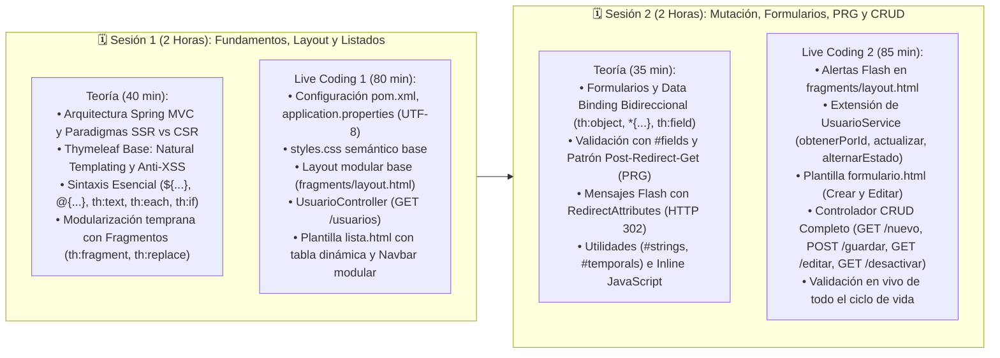

# 📋 Plan de Implementación: Semana 8 — Spring MVC y Thymeleaf (Live Coding)

Este documento es una guía pedagógica paso a paso, estructurada para guiar dos sesiones de clase equilibradas (2 horas cada una, 4 horas en total) en la **Semana 8 de Computación en Internet II (ICESI)**. Combina fundamentos teóricos de Server-Side Rendering (SSR) con codificación en vivo (*Live Coding*) para construir un módulo completo de **Gestión de Usuarios (CRUD visual + Fragmentos Modulares)**.

---

## ⏱️ Estructura Temporal Equilibrada (Semana 8)



---

# 📅 SESIÓN 1: Arquitectura MVC, Thymeleaf, Layout Modular y Listado Dinámico

### 🧭 Checklist de la Sesión 1:
- [ ] **1.1.** Explicar la arquitectura Spring MVC (`DispatcherServlet`, `HandlerMapping`, `Model`, `ViewResolver`).
- [ ] **1.2.** Comparar Server-Side Rendering (SSR con Thymeleaf) vs Client-Side Rendering (CSR con React/Vue).
- [ ] **1.3.** Presentar conceptos base de Thymeleaf: *Natural Templating* y seguridad anti-XSS (`th:text` vs `th:utext`).
- [ ] **1.4.** Explicar sintaxis esencial de lectura (`${...}`, `@{...}`, `#{...}`, `th:text`, `th:each`, `iterStat`, `th:if`/`th:unless`).
- [ ] **1.5.** Introducir el concepto de Fragmentos (`th:fragment`, `th:replace`) para evitar duplicar menús y encabezados.
- [ ] **1.6.** Configurar dependencias en `pom.xml` y soporte UTF-8 en `application.properties`.
- [ ] **1.7.** Crear la hoja de estilos semántica base `src/main/resources/static/css/styles.css`.
- [ ] **1.8.** Crear el fragmento de navegación modular `templates/fragments/layout.html`.
- [ ] **1.9.** Implementar `UsuarioController.java` (`@GetMapping("/usuarios")`) inyectando `UsuarioService`.
- [ ] **1.10.** Construir la plantilla limpia `templates/usuarios/lista.html` consumiendo el fragmento del Navbar y probando el renderizado en navegador.

---

## 📦 Paso 1: Configuración de Dependencias, Propiedades UTF-8 y Estilos Base

### 1.1. Dependencias en `pom.xml`
Validar que el proyecto incluya el starter de Thymeleaf y las dependencias web:

```xml
<!-- Spring Boot Web MVC -->
<dependency>
    <groupId>org.springframework.boot</groupId>
    <artifactId>spring-boot-starter-webmvc</artifactId>
</dependency>

<!-- Thymeleaf Template Engine -->
<dependency>
    <groupId>org.springframework.boot</groupId>
    <artifactId>spring-boot-starter-thymeleaf</artifactId>
</dependency>
```

### 1.2. Propiedades en `src/main/resources/application.properties`
Asegurar las propiedades de Thymeleaf y de codificación UTF-8 para desarrollo:

```properties
# ==============================================================================
# CONFIGURACIÓN THYMELEAF & ENTORNO DE DESARROLLO
# ==============================================================================
spring.thymeleaf.prefix=classpath:/templates/
spring.thymeleaf.suffix=.html
spring.thymeleaf.mode=HTML
spring.thymeleaf.encoding=UTF-8
spring.thymeleaf.cache=false

# Forzar codificación UTF-8 en peticiones y respuestas HTTP (evita mojibake en formularios y vistas)
spring.servlet.encoding.charset=UTF-8
spring.servlet.encoding.force=true
spring.servlet.encoding.enabled=true
```
---

## 🧩 Paso 2: Modularización Temprana: Layout Base y Navbar (`layout.html`)

**Ruta:** `src/main/resources/templates/fragments/layout.html`

> **Concepto a explicar en clase:**
> - `th:fragment="nombre"` declara un bloque reutilizable.
> - Definir la barra de navegación en un fragmento común desde la primera sesión asegura que todas las páginas mantengan la misma estructura de navegación sin duplicar código.

```html
<!DOCTYPE html>
<html lang="es" xmlns:th="http://www.thymeleaf.org">
<head>
    <meta charset="UTF-8">
</head>
<body>

    <!-- Fragmento de Barra de Navegación Común -->
    <header th:fragment="mainNavbar">
        <nav>
            <a th:href="@{/usuarios}">Portal Académico ICESI</a> |
            <a th:href="@{/usuarios}">Lista de Usuarios</a> |
            <a th:href="@{/usuarios/nuevo}">+ Registrar Usuario</a>
        </nav>
    </header>

</body>
</html>
```

---

## ☕ Paso 3: Controlador Web de Listado (`UsuarioController.java`)

**Ruta:** `src/main/java/com/compunet/springboot/controller/UsuarioController.java`

> **Concepto a explicar en clase:**
> - `@Controller` procesa peticiones web y retorna nombres de plantillas HTML (SSR).
> - El objeto `Model` es el transporte clave-valor que Thymeleaf lee con la sintaxis `${nombreAtributo}`.
> - El controlador **únicamente interactúa con `UsuarioService`**, manteniendo la separación de responsabilidades.

```java
package com.compunet.springboot.controller;

import java.util.List;
import org.springframework.stereotype.Controller;
import org.springframework.ui.Model;
import org.springframework.web.bind.annotation.GetMapping;
import org.springframework.web.bind.annotation.RequestMapping;

import com.compunet.springboot.model.Usuario;
import com.compunet.springboot.service.UsuarioService;

import lombok.RequiredArgsConstructor;

@Controller
@RequestMapping("/usuarios")
@RequiredArgsConstructor
public class UsuarioController {

    private final UsuarioService usuarioService;

    /**
     * Muestra la lista de usuarios del sistema.
     * Ruta: GET /usuarios
     */
    @GetMapping
    public String listarUsuarios(Model model) {
        List<Usuario> lista = usuarioService.listarUsuariosActivos();
        model.addAttribute("titulo", "Gestión de Usuarios Académicos");
        model.addAttribute("usuarios", lista);
        return "usuarios/lista"; // Resuelve: src/main/resources/templates/usuarios/lista.html
    }
}
```

---

## 🎨 Paso 4: Plantilla HTML con Fragmentos y Listado Dinámico (`lista.html`)

**Ruta:** `src/main/resources/templates/usuarios/lista.html`

> **Concepto a explicar en clase:**
> - `th:replace="~{fragments/layout :: mainNavbar}"` sustituye el `<header>` anfitrión por la barra de navegación común.
> - `th:each="u, stat : ${usuarios}"` itera sobre la colección inyectada en el `Model`.
> - `th:text="${u.nombre + ' ' + u.apellido}"` escapa automáticamente los caracteres especiales protegiendo contra XSS.
> - `th:if="${u.active}"` y `th:unless="${u.active}"` evalúan el estado booleano para renderizar etiquetas condicionales.

```html
<!DOCTYPE html>
<html lang="es" xmlns:th="http://www.thymeleaf.org">
<head>
    <meta charset="UTF-8">
    <title th:text="${titulo}">Gestión de Usuarios</title>
    <!-- Enlace a estilos estáticos con contexto seguro -->
    <link rel="stylesheet" th:href="@{/css/styles.css}">
</head>
<body>

    <!-- 1. Barra de Navegación Modular (Fragmento) -->
    <header th:replace="~{fragments/layout :: mainNavbar}"></header>

    <main>
        <h1 th:text="${titulo}">Gestión de Usuarios</h1>
        <p><a th:href="@{/usuarios/nuevo}" class="button">+ Registrar Usuario</a></p>

        <table>
            <thead>
                <tr>
                    <th>#</th>
                    <th>Nombre Completo</th>
                    <th>Correo Institucional</th>
                    <th>Estado</th>
                    <th>Acciones</th>
                </tr>
            </thead>
            <tbody>
                <!-- Mensaje si la lista está vacía -->
                <tr th:if="${#lists.isEmpty(usuarios)}">
                    <td colspan="5">No hay usuarios registrados actualmente.</td>
                </tr>

                <!-- Iteración de Usuarios con iterStat -->
                <tr th:each="u, stat : ${usuarios}">
                    <td th:text="${stat.count}">1</td>
                    <td th:text="${u.nombre + ' ' + u.apellido}">Juan Pérez</td>
                    <td th:text="${u.correoInstitucional}">jperez@icesi.edu.co</td>
                    <td>
                        <span th:if="${u.active}">Activo</span>
                        <span th:unless="${u.active}">Inactivo</span>
                    </td>
                    <td>
                        <a th:href="@{/usuarios/editar/{id}(id=${u.id})}">Editar</a> |
                        <a th:href="@{/usuarios/desactivar/{id}(id=${u.id})}" 
                           onclick="return confirm('¿Está seguro de cambiar el estado de este usuario?');">
                            Cambiar Estado
                        </a>
                    </td>
                </tr>
            </tbody>
        </table>
    </main>

</body>
</html>
```

---

# 📅 SESIÓN 2: Formularios, Data Binding, Patrón PRG, Extensión de Servicio y CRUD Completo

### 🧭 Checklist de la Sesión 2:
- [ ] **2.1.** Explicar Data Binding bidireccional (`th:object`, Selection Expressions `*{...}` y `th:field`).
- [ ] **2.2.** Abordar el manejo de validaciones y errores con `#fields.hasErrors(...)` y `th:errors`.
- [ ] **2.3.** Explicar la prevención del doble envío de formulario mediante el **Patrón Post-Redirect-Get (PRG)** y `RedirectAttributes`.
- [ ] **2.4.** Presentar objetos de utilidad de expresión (`#strings`, `#numbers`, `#temporals`, `#lists`) e interpolación con `th:inline="javascript"`.
- [ ] **2.5.** Agregar el fragmento de Alertas Flash en `templates/fragments/layout.html`.
- [ ] **2.6.** Implementar métodos de negocio en `UsuarioService.java` (`obtenerPorId`, `actualizarUsuario`, `alternarEstado`).
- [ ] **2.7.** Construir la plantilla semántica `templates/usuarios/formulario.html` para Creación y Edición.
- [ ] **2.8.** Implementar los endpoints CRUD en `UsuarioController.java` (`GET /nuevo`, `POST /guardar`, `GET /editar/{id}`, `GET /desactivar/{id}`).
- [ ] **2.9.** Probar el flujo completo en el navegador validando alertas flash y persistencia en base de datos.

---

## 🧩 Paso 5: Alertas Flash en el Layout Modular (`layout.html`)

**Ruta:** `src/main/resources/templates/fragments/layout.html`

> **Concepto a explicar en clase:**
> - Centralizamos el bloque de alertas para que cualquier vista (`lista.html` o `formulario.html`) pueda mostrar notificaciones flash (`${exito}` o `${error}`) simplemente usando `th:replace="~{fragments/layout :: alerts}"`.

```html
<!DOCTYPE html>
<html lang="es" xmlns:th="http://www.thymeleaf.org">
<head>
    <meta charset="UTF-8">
</head>
<body>

    <!-- 1. Fragmento de Barra de Navegación -->
    <header th:fragment="mainNavbar">
        <nav>
            <a th:href="@{/usuarios}">Portal Académico ICESI</a> |
            <a th:href="@{/usuarios}">Lista de Usuarios</a> |
            <a th:href="@{/usuarios/nuevo}">+ Registrar Usuario</a>
        </nav>
    </header>

    <!-- 2. Fragmento de Mensajes Flash (Alertas temporales) -->
    <div th:fragment="alerts">
        <div th:if="${exito}" class="alert alert-success">
            <span th:text="${exito}">Operación realizada con éxito</span>
        </div>
        <div th:if="${error}" class="alert alert-danger">
            <span th:text="${error}">Ha ocurrido un error</span>
        </div>
    </div>

</body>
</html>
```
---

## 📝 Paso 7: Formulario Limpio de Creación y Edición (`formulario.html`)

**Ruta:** `src/main/resources/templates/usuarios/formulario.html`

> **Concepto a explicar en clase:**
> - `th:object="${usuario}"` vincula el formulario a la entidad del modelo.
> - `th:field="*{id}"` como campo oculto (`type="hidden"`): si el ID es nulo se procesa como **Creación**; si contiene un valor numérico se procesa como **Edición**.
> - `th:field="*{nombre}"` genera automáticamente `name="nombre"`, `id="nombre"` y precarga el `value` existente al editar.

```html
<!DOCTYPE html>
<html lang="es" xmlns:th="http://www.thymeleaf.org">
<head>
    <meta charset="UTF-8">
    <title th:text="${titulo}">Formulario de Usuario</title>
    <link rel="stylesheet" th:href="@{/css/styles.css}">
</head>
<body>

    <!-- 1. Navbar Modular -->
    <header th:replace="~{fragments/layout :: mainNavbar}"></header>

    <!-- 2. Alertas Flash Modulares -->
    <div th:replace="~{fragments/layout :: alerts}"></div>

    <main>
        <h2 th:text="${titulo}">Registrar Usuario</h2>

        <form th:action="@{/usuarios/guardar}" th:object="${usuario}" method="post">
            
            <!-- Campo oculto para ID (Distingue Crear vs Actualizar) -->
            <input type="hidden" th:field="*{id}" />

            <div>
                <label for="nombre">Nombre:</label>
                <input type="text" id="nombre" th:field="*{nombre}" required />
            </div>

            <div>
                <label for="apellido">Apellido:</label>
                <input type="text" id="apellido" th:field="*{apellido}" required />
            </div>

            <div>
                <label for="correo">Correo Institucional:</label>
                <input type="email" id="correo" th:field="*{correoInstitucional}" required />
            </div>

            <div>
                <label for="password">Contraseña:</label>
                <input type="password" id="password" th:field="*{password}" />
            </div>

            <div>
                <label for="rol">Rol Principal:</label>
                <select id="rol" name="nombreRol" required>
                    <option value="ESTUDIANTE" selected>Estudiante</option>
                    <option value="PROFESOR">Profesor</option>
                    <option value="ADMINISTADOR">Administrdor</option>
                </select>
            </div>

            <div>
                <label for="active">
                    <input type="checkbox" id="active" th:field="*{active}"> Usuario Activo
                </label>
            </div>

            <div>
                <button type="submit">Guardar Usuario</button>
                <a th:href="@{/usuarios}" class="button button-secondary">Cancelar</a>
            </div>

        </form>
    </main>

</body>
</html>
```

---

## 🚀 Paso 8: Controlador Web Completo con CRUD y Patrón PRG (`UsuarioController.java`)

**Ruta:** `src/main/java/com/compunet/springboot/controller/UsuarioController.java`

> **Conceptos Clave:**
> - **Post-Redirect-Get (PRG):** El método `guardarUsuario` responde con `return "redirect:/usuarios"`. Esto previene que un usuario reenvíe datos duplicados si presiona F5 en su navegador.
> - `RedirectAttributes.addFlashAttribute(...)` transporta notificaciones temporales mediante la sesión HTTP que sobreviven a la redirección HTTP 302 y se destruyen inmediatamente tras mostrarse.

```java
package com.compunet.springboot.controller;

import java.util.List;

import org.springframework.stereotype.Controller;
import org.springframework.ui.Model;
import org.springframework.web.bind.annotation.GetMapping;
import org.springframework.web.bind.annotation.ModelAttribute;
import org.springframework.web.bind.annotation.PathVariable;
import org.springframework.web.bind.annotation.PostMapping;
import org.springframework.web.bind.annotation.RequestMapping;
import org.springframework.web.bind.annotation.RequestParam;
import org.springframework.web.servlet.mvc.support.RedirectAttributes;

import com.compunet.springboot.model.Usuario;
import com.compunet.springboot.service.UsuarioService;

import lombok.RequiredArgsConstructor;

@Controller
@RequestMapping("/usuarios")
@RequiredArgsConstructor
public class UsuarioController {

    private final UsuarioService usuarioService;

    /**
     * 1. LISTAR: GET /usuarios
     */
    @GetMapping
    public String listarUsuarios(Model model) {
        List<Usuario> lista = usuarioService.listarUsuariosActivos();
        model.addAttribute("titulo", "Gestión de Usuarios Académicos");
        model.addAttribute("usuarios", lista);
        return "usuarios/lista";
    }

    /**
     * 2. MOSTRAR FORMULARIO CREACIÓN: GET /usuarios/nuevo
     */
    @GetMapping("/nuevo")
    public String mostrarFormularioCreacion(Model model) {
        Usuario nuevoUsuario = new Usuario();
        nuevoUsuario.setActive(true);
        model.addAttribute("titulo", "Registrar Nuevo Usuario");
        model.addAttribute("usuario", nuevoUsuario);
        return "usuarios/formulario";
    }

    /**
     * 3. GUARDAR (CREAR O EDITAR): POST /usuarios/guardar
     * Aplica el patrón POST-REDIRECT-GET (PRG)
     */
    @PostMapping("/guardar")
    public String guardarUsuario(@ModelAttribute("usuario") Usuario usuario,
                                 @RequestParam(value = "nombreRol", defaultValue = "ESTUDIANTE") String nombreRol,
                                 RedirectAttributes flash) {
        try {
            if (usuario.getId() == null) {
                // Modo Creación: Delegado al Servicio
                usuarioService.registrarUsuario(usuario, nombreRol);
                flash.addFlashAttribute("exito", "¡Usuario registrado exitosamente!");
            } else {
                // Modo Edición: Delegado al Servicio
                usuarioService.actualizarUsuario(usuario.getId(), usuario);
                flash.addFlashAttribute("exito", "¡Usuario actualizado exitosamente!");
            }
        } catch (IllegalArgumentException | IllegalStateException e) {
            flash.addFlashAttribute("error", e.getMessage());
            return "redirect:/usuarios/nuevo";
        } catch (Exception e) {
            flash.addFlashAttribute("error", "Error inesperado al procesar la solicitud.");
            return "redirect:/usuarios";
        }

        return "redirect:/usuarios"; // Patrón PRG (HTTP 302)
    }

    /**
     * 4. MOSTRAR FORMULARIO EDICIÓN: GET /usuarios/editar/{id}
     */
    @GetMapping("/editar/{id}")
    public String mostrarFormularioEdicion(@PathVariable("id") Long id, Model model, RedirectAttributes flash) {
        Usuario usuario = usuarioService.obtenerPorId(id).orElse(null);
        if (usuario == null) {
            flash.addFlashAttribute("error", "El usuario con ID " + id + " no existe.");
            return "redirect:/usuarios";
        }
        model.addAttribute("titulo", "Editar Usuario: " + usuario.getNombre());
        model.addAttribute("usuario", usuario);
        return "usuarios/formulario";
    }

    /**
     * 5. CAMBIAR ESTADO (Activar / Desactivar): GET /usuarios/desactivar/{id}
     */
    @GetMapping("/desactivar/{id}")
    public String alternarEstadoUsuario(@PathVariable("id") Long id, RedirectAttributes flash) {
        try {
            Usuario u = usuarioService.alternarEstado(id);
            String estadoStr = u.isActive() ? "activado" : "desactivado";
            flash.addFlashAttribute("exito", "Usuario " + u.getNombre() + " " + estadoStr + " correctamente.");
        } catch (IllegalArgumentException e) {
            flash.addFlashAttribute("error", e.getMessage());
        }
        return "redirect:/usuarios";
    }
}
```

---

## 📊 Resumen para la Pizarra: Sintaxis Thymeleaf

| Expresión / Atributo | Propósito | Ejemplo en Código |
| :--- | :--- | :--- |
| **`${...}`** | Evaluar variables del `Model` o beans | `<p th:text="${usuario.nombre}"></p>` |
| **`*{...}`** | Selección relativa sobre `th:object` | `<input th:field="*{correoInstitucional}" />` |
| **`@{...}`** | Generación de URLs relativas al context path | `<a th:href="@{/usuarios/editar/{id}(id=${u.id})}">` |
| **`~{...}`** | Inserción/Reemplazo de fragmentos | `<header th:replace="~{fragments/layout :: mainNavbar}"></header>` |
| **`th:each`** | Iteración sobre colecciones o listas | `<tr th:each="u, stat : ${usuarios}">` |
| **`th:if` / `th:unless`** | Renderizado condicional en servidor | `<span th:if="${u.active}">Activo</span>` |
| **`redirect:/ruta`** | Patrón Post-Redirect-Get (HTTP 302) | `return "redirect:/usuarios";` |
| **`addFlashAttribute`** | Mensaje flash que persiste una redirección | `flash.addFlashAttribute("exito", "Guardado");` |
