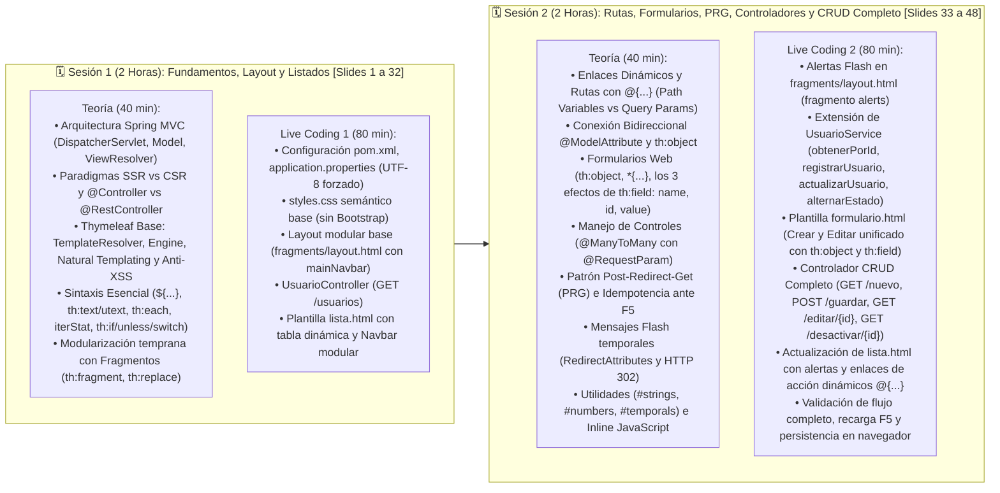

# 📋 Plan de Implementación: Semana 8 — Spring MVC y Thymeleaf (Live Coding)

Este documento es una guía pedagógica paso a paso, estructurada para orientar dos sesiones de clase equilibradas (2 horas cada una, 4 horas en total) en la **Semana 8 de Computación en Internet II (ICESI)**. Combina fundamentos teóricos de Server-Side Rendering (SSR) con codificación en vivo (*Live Coding*) para construir un módulo completo de **Gestión de Usuarios (CRUD visual + Fragmentos Modulares + Patrón PRG)**.

---

## ⏱️ Estructura Temporal Equilibrada (Semana 8)



---

# 📅 SESIÓN 1: Arquitectura MVC, Thymeleaf, Layout Modular y Listado Dinámico
*(Cubierta en la Clase 1 — Slides 1 a 32)*

### 🧭 Checklist de la Sesión 1:
- [x] **1.1.** Explicación de la arquitectura Spring MVC (`DispatcherServlet`, `HandlerMapping`, `Model`, `ViewResolver`).
- [x] **1.2.** Comparativa Server-Side Rendering (SSR con Thymeleaf) vs Client-Side Rendering (CSR con React/Vue).
- [x] **1.3.** Conceptos base de Thymeleaf: *Natural Templating* y seguridad anti-XSS (`th:text` vs `th:utext`).
- [x] **1.4.** Sintaxis de lectura: `${...}`, `th:text`, `th:each` con `iterStat` (`count`, `even`, `odd`, `first`), `th:if`/`th:unless` y `th:switch`/`th:case`.
- [x] **1.5.** Modularización con Fragmentos (`th:fragment`, `th:replace`, `th:insert`).
- [x] **1.6.** Configuración de dependencias en `pom.xml` y codificación forzada UTF-8 en `application.properties`.
- [x] **1.7.** Hoja de estilos semántica base `src/main/resources/static/css/styles.css`.
- [x] **1.8.** Fragmento de navegación modular `templates/fragments/layout.html` (`mainNavbar`).
- [x] **1.9.** Controlador base `UsuarioController.java` (`@GetMapping("/usuarios")`) inyectando `UsuarioService`.
- [x] **1.10.** Plantilla `templates/usuarios/lista.html` consumiendo el fragmento del Navbar y renderizando datos en servidor.

---

# 📅 SESIÓN 2: Rutas Dinámicas, Formularios, Data Binding, Patrón PRG, Controladores MVC y CRUD Completo
*(Clase 2 — Slides 33 a 48)*

### 🧭 Checklist Temático y Práctico de la Sesión 2:
- [ ] **2.1. Teoría:** Enlaces Dinámicos y Rutas con `@{...}` (Recursos estáticos, Path Variables `@{/ruta/{id}(id=${u.id})}` y Query Params `@{/ruta(p1=v1, p2=v2)}`).
- [ ] **2.2. Teoría:** Criterios de decisión: ¿Cuándo usar Path Variables vs Query Parameters?
- [ ] **2.3. Teoría:** Conexión bidireccional `@ModelAttribute` $\longleftrightarrow$ `th:object` (Ciclo GET $\rightarrow$ HTML $\rightarrow$ POST).
- [ ] **2.4. Teoría:** Formularios Web y Binding Bidireccional (`th:object`, Selection Expressions `*{...}` y los **3 Efectos Clave de `th:field`**: `name`, `id`, `value`).
- [ ] **2.5. Teoría:** Mapeo de controles HTML (`<input type="text">`, `<input type="hidden">`, `<input type="checkbox">`, y `<select>` con `@RequestParam` para relaciones `@ManyToMany`).
- [ ] **2.6. Teoría:** El **Patrón Post / Redirect / Get (PRG)** a profundidad (Peligro de duplicación con F5, Fase POST 302, Fase GET 200 idempotente).
- [ ] **2.7. Teoría:** Mensajes Flash temporales (`RedirectAttributes.addFlashAttribute(...)`) que sobreviven al HTTP 302.
- [ ] **2.8. Teoría:** Controladores Web MVC (`Model`, `@PathVariable`, `@RequestParam`, `@PostMapping` con `@ModelAttribute`).
- [ ] **2.9. Teoría:** Utilidades de Expresión (`#strings`, `#numbers`, `#temporals`, `#lists`) e Inline JavaScript (`th:inline="javascript"`).
- [ ] **2.10. Teoría:** Resumen de Buenas Prácticas (4 Pilares: XSS por defecto, Natural Templating, Separación de Responsabilidades, Idempotencia PRG).
- [ ] **2.11. Práctica (Paso 5):** Crear fragmento de Alertas Flash en `templates/fragments/layout.html`.
- [ ] **2.12. Práctica (Paso 6):** Implementar métodos de negocio en `UsuarioService.java` (`obtenerPorId`, `registrarUsuario`, `actualizarUsuario` con validación de correo único, `alternarEstado`).
- [ ] **2.13. Práctica (Paso 7):** Construir la plantilla semántica `templates/usuarios/formulario.html` (Crear y Editar unificado).
- [ ] **2.14. Práctica (Paso 8):** Implementar los endpoints CRUD en `UsuarioController.java` (`GET /nuevo`, `POST /guardar` con PRG y Flash, `GET /editar/{id}`, `GET /desactivar/{id}`).
- [ ] **2.15. Práctica (Paso 9):** Integrar Alertas y Enlaces Dinámicos en `templates/usuarios/lista.html`.
- [ ] **2.16. Práctica (Paso 10):** Probar el flujo completo en navegador: Creación, Edición, Cambio de estado, Presionar F5 tras guardar (verificando que no duplica registros), y Alertas Flash temporales.

---

## 🧩 Paso 5: Alertas Flash en el Layout Modular (`layout.html`)

**Ruta:** `src/main/resources/templates/fragments/layout.html`

> **Concepto a explicar en clase:**
> - Centralizamos el bloque de alertas para que cualquier vista (`lista.html` o `formulario.html`) pueda mostrar notificaciones flash (`${exito}` o `${error}`) simplemente usando `th:replace="~{fragments/layout :: alerts}"`.
> - Los mensajes flash provienen de `RedirectAttributes` tras un redirect HTTP 302 (PRG) y se auto-destruyen en la sesión una vez leídos.

```html
<!DOCTYPE html>
<html lang="es" xmlns:th="http://www.thymeleaf.org">
<head>
    <meta charset="UTF-8">
</head>
<body>

    <!-- 1. Fragmento de Barra de Navegación -->
    <header th:fragment="mainNavbar">
        <nav>
            <a th:href="@{/usuarios}">Portal Académico ICESI</a> |
            <a th:href="@{/usuarios}">Lista de Usuarios</a> |
            <a th:href="@{/usuarios/nuevo}">+ Registrar Usuario</a>
        </nav>
    </header>

    <!-- 2. Fragmento de Mensajes Flash (Alertas temporales) -->
    <div th:fragment="alerts">
        <div th:if="${exito}" class="alert alert-success">
            <span th:text="${exito}">Operación realizada con éxito</span>
        </div>
        <div th:if="${error}" class="alert alert-danger">
            <span th:text="${error}">Ha ocurrido un error</span>
        </div>
    </div>

</body>
</html>
```

---

## 💼 Paso 6: Métodos de Negocio en la Capa de Servicio (`UsuarioService.java`)

**Ruta:** `src/main/java/com/compunet/springboot/service/UsuarioService.java`

> **Concepto a explicar en clase (Arquitectura Limpia):**
> - El controlador MVC **nunca debe mutar entidades directamente ni acceder a repositorios**.
> - Toda la lógica de negocio (búsqueda por ID, validación de correo duplicado en actualización, alternancia de estado, asignación de rol desde BD) se encapsula en el `@Service`.

```java
// Métodos en UsuarioService.java:

/**
 * Busca un usuario por su ID primario.
 */
public Optional<Usuario> obtenerPorId(Long id) {
}

/**
 * Registra un nuevo usuario validando correo único y asignando su rol inicial.
 */
public Usuario registrarUsuario(Usuario usuario, String nombreRolInicial) {

}

/**
 * Actualiza los datos de un usuario existente validando reglas de negocio.
 */
public Usuario actualizarUsuario(Long id, Usuario usuarioActualizado) {
}

/**
 * Alterna el estado activo/inactivo de un usuario (Soft delete / Reactivación).
 */
@Transactional
public Usuario alternarEstado(Long id) {
}
```

---

## 📝 Paso 7: Formulario Unificado de Creación y Edición (`formulario.html`)

**Ruta:** `src/main/resources/templates/usuarios/formulario.html`

> **Concepto a explicar en clase:**
> - `th:object="${usuario}"` vincula el formulario a la entidad del modelo.
> - `th:field="*{id}"` como campo oculto (`type="hidden"`): si el ID es nulo se procesa como **Creación**; si contiene un valor numérico se procesa como **Edición**.
> - **Los 3 Efectos de `th:field`:** genera `name="..."`, `id="..."` y rellena el `value="..."` automáticamente en modo edición.
> - `th:field="*{active}"` genera automáticamente un checkbox con binding booleano.
> - **Manejo de Relación `@ManyToMany`:** La entidad `Usuario` no tiene una columna simple `nombreRol`, sino una colección `List<Rol> roles`. Por ello, el selector de rol usa `name="nombreRol"` estándar y viaja como `@RequestParam` al controlador para que el servicio busque y asigne la entidad `Rol` correspondiente.

```html
<!DOCTYPE html>
<html lang="es" xmlns:th="http://www.thymeleaf.org">
<head>
    <meta charset="UTF-8">
    <title th:text="${titulo}">Formulario de Usuario</title>
    <link rel="stylesheet" th:href="@{/css/styles.css}">
</head>
<body>

    <!-- 1. Navbar Modular -->
    <header th:replace="~{fragments/layout :: mainNavbar}"></header>

    <!-- 2. Alertas Flash Modulares -->
    <div th:replace="~{fragments/layout :: alerts}"></div>

    <main>
        <h2 th:text="${titulo}">Registrar Usuario</h2>

        <form th:action="@{/usuarios/guardar}" th:object="${usuario}" method="post">
            
            <!-- Campo oculto para ID (Distingue Crear vs Actualizar) -->
            <input type="hidden" th:field="*{id}" />

            <div>
                <label for="nombre">Nombre:</label>
                <input type="text" id="nombre" th:field="*{nombre}" required />
            </div>

            <div>
                <label for="apellido">Apellido:</label>
                <input type="text" id="apellido" th:field="*{apellido}" required />
            </div>

            <div>
                <label for="correo">Correo Institucional:</label>
                <input type="email" id="correo" th:field="*{correoInstitucional}" required />
            </div>

            <div>
                <label for="password">Contraseña:</label>
                <input type="password" id="password" th:field="*{password}" />
            </div>

            <div>
                <label for="rol">Rol Principal:</label>
                <select id="rol" name="nombreRol" required>
                    <option value="ESTUDIANTE" selected>Estudiante</option>
                    <option value="PROFESOR">Profesor</option>
                    <option value="ADMIN">Administrador</option>
                </select>
            </div>

            <div>
                <label for="active">
                    <input type="checkbox" id="active" th:field="*{active}"> Usuario Activo
                </label>
            </div>

            <div>
                <button type="submit">Guardar Usuario</button>
                <a th:href="@{/usuarios}">Cancelar</a>
            </div>

        </form>
    </main>

</body>
</html>
```

---

## 🚀 Paso 8: Controlador Web Completo con CRUD y Patrón PRG (`UsuarioController.java`)

**Ruta:** `src/main/java/com/compunet/springboot/controller/UsuarioController.java`

> **Conceptos Clave a Explicar en Clase:**
> - **Post-Redirect-Get (PRG):** El método `guardarUsuario` responde con `return "redirect:/usuarios"` (HTTP 302). Esto previene que un usuario reenvíe datos duplicados si presiona F5 en su navegador.
> - `RedirectAttributes.addFlashAttribute(...)` transporta notificaciones temporales mediante la sesión HTTP que sobreviven a la redirección HTTP 302 y se destruyen inmediatamente tras mostrarse.
> - `@PathVariable("id")` captura variables de ruta tipo `/usuarios/editar/{id}` y `/usuarios/desactivar/{id}`.
> - `@ModelAttribute("usuario")` deserializa automáticamente los campos mapeados con `th:field`, y `@RequestParam("nombreRol")` captura el rol seleccionado del dropdown.

```java
package com.compunet.springboot.controller;

import java.util.List;

import org.springframework.stereotype.Controller;
import org.springframework.ui.Model;
import org.springframework.web.bind.annotation.GetMapping;
import org.springframework.web.bind.annotation.ModelAttribute;
import org.springframework.web.bind.annotation.PathVariable;
import org.springframework.web.bind.annotation.PostMapping;
import org.springframework.web.bind.annotation.RequestMapping;
import org.springframework.web.bind.annotation.RequestParam;
import org.springframework.web.servlet.mvc.support.RedirectAttributes;

import com.compunet.springboot.model.Usuario;
import com.compunet.springboot.service.UsuarioService;

import lombok.RequiredArgsConstructor;

@Controller
@RequestMapping("/usuarios")
@RequiredArgsConstructor
public class UsuarioController {

    private final UsuarioService usuarioService;

    /**
     * 1. LISTAR: GET /usuarios
     */
    @GetMapping
    public String listarUsuarios(Model model) {
        List<Usuario> lista = usuarioService.listarUsuariosActivos();
        model.addAttribute("titulo", "Gestión de Usuarios Académicos");
        model.addAttribute("usuarios", lista);
        return "usuarios/lista";
    }

    /**
     * 2. MOSTRAR FORMULARIO CREACIÓN: GET /usuarios/nuevo
     */
    @GetMapping("/nuevo")
    public String mostrarFormularioCreacion(Model model) {
        Usuario nuevoUsuario = new Usuario();
        nuevoUsuario.setActive(true);
        model.addAttribute("titulo", "Registrar Nuevo Usuario");
        model.addAttribute("usuario", nuevoUsuario);
        return "usuarios/formulario";
    }

    /**
     * 3. GUARDAR (CREAR O EDITAR): POST /usuarios/guardar
     * Aplica el patrón POST-REDIRECT-GET (PRG)
     */
    @PostMapping("/guardar")
    public String guardarUsuario(@ModelAttribute("usuario") Usuario usuario,
                                 @RequestParam(value = "nombreRol", defaultValue = "ESTUDIANTE") String nombreRol,
                                 RedirectAttributes redirectAttrs) {
        try {
            if (usuario.getId() == null) {
                // Modo Creación: Delegado al Servicio con el rol seleccionado
                usuarioService.registrarUsuario(usuario, nombreRol);
                redirectAttrs.addFlashAttribute("exito", "¡Usuario registrado exitosamente!");
            } else {
                // Modo Edición: Delegado al Servicio
                usuarioService.actualizarUsuario(usuario.getId(), usuario);
                redirectAttrs.addFlashAttribute("exito", "¡Usuario actualizado exitosamente!");
            }
        } catch (IllegalArgumentException | IllegalStateException e) {
            redirectAttrs.addFlashAttribute("error", e.getMessage());
            return "redirect:/usuarios/nuevo";
        } catch (Exception e) {
            redirectAttrs.addFlashAttribute("error", "Error inesperado al procesar la solicitud.");
            return "redirect:/usuarios";
        }

        return "redirect:/usuarios"; // Patrón PRG (HTTP 302)
    }

    /**
     * 4. MOSTRAR FORMULARIO EDICIÓN: GET /usuarios/editar/{id}
     */
    @GetMapping("/editar/{id}")
    public String mostrarFormularioEdicion(@PathVariable("id") Long id, 
                                          Model model, 
                                          RedirectAttributes redirectAttrs) {
        Usuario usuario = usuarioService.obtenerPorId(id).orElse(null);
        if (usuario == null) {
            redirectAttrs.addFlashAttribute("error", "El usuario con ID " + id + " no existe.");
            return "redirect:/usuarios";
        }
        model.addAttribute("titulo", "Editar Usuario: " + usuario.getNombre());
        model.addAttribute("usuario", usuario);
        return "usuarios/formulario";
    }

    /**
     * 5. CAMBIAR ESTADO (Activar / Desactivar): GET /usuarios/desactivar/{id}
     */
    @GetMapping("/desactivar/{id}")
    public String alternarEstadoUsuario(@PathVariable("id") Long id, 
                                        RedirectAttributes redirectAttrs) {
        try {
            Usuario u = usuarioService.alternarEstado(id);
            String estadoStr = u.isActive() ? "activado" : "desactivado";
            redirectAttrs.addFlashAttribute("exito", "Usuario " + u.getNombre() + " " + estadoStr + " correctamente.");
        } catch (IllegalArgumentException e) {
            redirectAttrs.addFlashAttribute("error", e.getMessage());
        }
        return "redirect:/usuarios";
    }
}
```

---

## 🎨 Paso 9: Actualización de `lista.html` con Alertas y Enlaces Dinámicos `@{...}`

**Ruta:** `src/main/resources/templates/usuarios/lista.html`

```html
<!DOCTYPE html>
<html lang="es" xmlns:th="http://www.thymeleaf.org">
<head>
    <meta charset="UTF-8">
    <title th:text="${titulo}">Gestión de Usuarios</title>
    <link rel="stylesheet" th:href="@{/css/styles.css}">
</head>
<body>

    <!-- 1. Barra de Navegación Modular (Fragmento) -->
    <header th:replace="~{fragments/layout :: mainNavbar}"></header>

    <!-- 2. Alertas Flash Modulares (Fragmento) -->
    <div th:replace="~{fragments/layout :: alerts}"></div>

    <main>
        <h1 th:text="${titulo}">Gestión de Usuarios</h1>
        <p><a th:href="@{/usuarios/nuevo}">+ Registrar Usuario</a></p>

        <table>
            <thead>
                <tr>
                    <th>#</th>
                    <th>Nombre Completo</th>
                    <th>Correo Institucional</th>
                    <th>Estado</th>
                    <th>Acciones</th>
                </tr>
            </thead>
            <tbody>
                <!-- Mensaje si la lista está vacía -->
                <tr th:if="${#lists.isEmpty(usuarios)}">
                    <td colspan="5">No hay usuarios registrados actualmente.</td>
                </tr>

                <!-- Iteración de Usuarios con iterStat -->
                <tr th:each="u, stat : ${usuarios}">
                    <td th:text="${stat.count}">1</td>
                    <td th:text="${u.nombre + ' ' + u.apellido}">Juan Pérez</td>
                    <td th:text="${u.correoInstitucional}">jperez@icesi.edu.co</td>
                    <td>
                        <span th:if="${u.active}">Activo</span>
                        <span th:unless="${u.active}">Inactivo</span>
                    </td>
                    <td>
                        <a th:href="@{/usuarios/editar/{id}(id=${u.id})}">Editar</a> |
                        <a th:href="@{/usuarios/desactivar/{id}(id=${u.id})}" 
                           onclick="return confirm('¿Está seguro de cambiar el estado de este usuario?');">
                            Cambiar Estado
                        </a>
                    </td>
                </tr>
            </tbody>
        </table>
    </main>

</body>
</html>
```

---

## 🧪 Paso 10: Pruebas de Flujo, F5 y Validación en Vivo

### Escenarios de Prueba para la Clase:
1. **Flujo de Creación (POST -> 302 -> GET):**
   - Acceder a `http://localhost:8080/usuarios/nuevo`.
   - Llenar formulario y seleccionar rol.
   - Observar en consola el log de Spring: Petición `POST /usuarios/guardar` seguida automáticamente de `GET /usuarios`.
   - Verificar la aparición de la alerta verde: *"¡Usuario registrado exitosamente!"*.
2. **Prueba de Idempotencia F5 (Patrón PRG):**
   - Estando en la lista tras registrar un usuario, presionar **F5** o botón Recargar.
   - Constatar que el navegador no muestra el modal de confirmación *"¿Desea reenviar el formulario?"*.
   - Verificar que la alerta flash ha desaparecido limpiamente y no se ha creado un registro duplicado.
3. **Flujo de Edición (`@PathVariable` + Precarga con `th:field`):**
   - Clic en *"Editar"* (`/usuarios/editar/1`).
   - Validar que los campos vienen precargados con los datos actuales del usuario.
   - Modificar el nombre y guardar.
   - Verificar que la tabla refleja el cambio y se emite la alerta de éxito.
4. **Flujo de Cambio de Estado (`alternarEstado`):**
   - Clic en *"Cambiar Estado"* (`/usuarios/desactivar/1`).
   - Validar el mensaje de alerta y el cambio de etiqueta *"Activo"* / *"Inactivo"*.

---

## 📊 Resumen para la Pizarra: Sintaxis y Patrones

| Expresión / Concepto | Propósito | Ejemplo en Código |
| :--- | :--- | :--- |
| **`@{...}`** | Construir URLs context-aware y path variables | `<a th:href="@{/usuarios/editar/{id}(id=${u.id})}">` |
| **`@{/r(p=v)}`** | Query parameters con sintaxis de tupla | `<a th:href="@{/usuarios(estado='activo', page=1)}">` |
| **`th:object`** | Vincular formulario a entidad del `Model` | `<form th:object="${usuario}" method="post">` |
| **`*{...}`** | Selección relativa sobre `th:object` | `<input th:field="*{correoInstitucional}" />` |
| **`th:field`** | Genera `name`, `id` y precarga `value` | `<input type="text" th:field="*{nombre}" />` |
| **`PRG (302)`** | Prevenir doble inserción al presionar F5 | `return "redirect:/usuarios";` |
| **`Flash Attributes`**| Mensajes que persisten una redirección | `redirectAttrs.addFlashAttribute("exito", "Ok");` |
| **`#strings` / `#temporals`** | Objetos de ayuda en expresiones | `<span th:text="${#temporals.format(u.fecha, 'dd/MM/yyyy')}">` |
