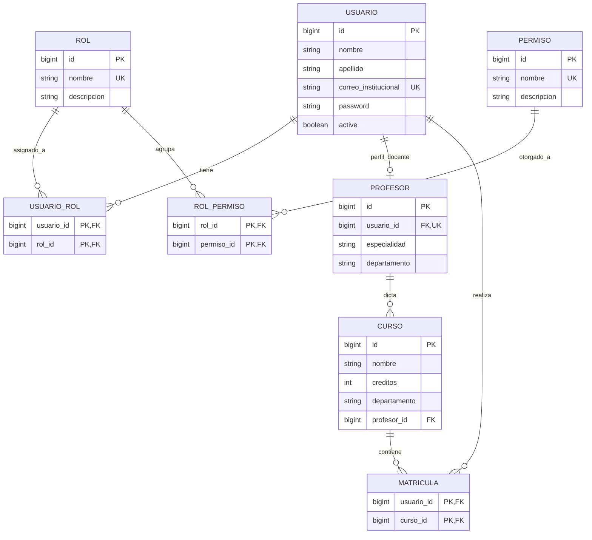

# Modelo Relacional - Sistema Académico

---

## Descripción de Entidades y Relaciones

| Entidad / Tabla | Descripción | Llave Primaria (PK) | Llaves Foráneas (FK) |
| :--- | :--- | :--- | :--- |
| **`USUARIO`** | Almacena los usuarios del sistema (estudiantes, docentes, administradores). | `id` | - |
| **`ROL`** | Catálogo de roles del sistema de seguridad (`ADMINISTRADOR`, `PROFESOR`, `ESTUDIANTE`). | `id` | - |
| **`PERMISO`** | Permisos atómicos del sistema RBAC (`USER_CREATE`, `COURSE_READ`, etc.). | `id` | - |
| **`USUARIO_ROL`** | Relación muchos a muchos ($M:N$) entre Usuarios y Roles. | `(usuario_id, rol_id)` | `usuario_id` &rarr; `USUARIO(id)` `rol_id` &rarr; `ROL(id)` |
| **`ROL_PERMISO`** | Relación muchos a muchos ($M:N$) entre Roles y Permisos. | `(rol_id, permiso_id)` | `rol_id` &rarr; `ROL(id)` `permiso_id` &rarr; `PERMISO(id)` |
| **`PROFESOR`** | Perfil docente vinculado a un Usuario mediante relación uno a uno ($1:1$). | `id` | `usuario_id` &rarr; `USUARIO(id)` (UK) |
| **`CURSO`** | Asignaturas académicas dictadas por un Profesor ($1:N$). | `id` | `profesor_id` &rarr; `PROFESOR(id)` |
| **`MATRICULA`** | Registro de inscripción de un Estudiante (`Usuario`) en un `Curso` ($M:N$). | `(usuario_id, curso_id)` | `usuario_id` &rarr; `USUARIO(id)` `curso_id` &rarr; `CURSO(id)` |
