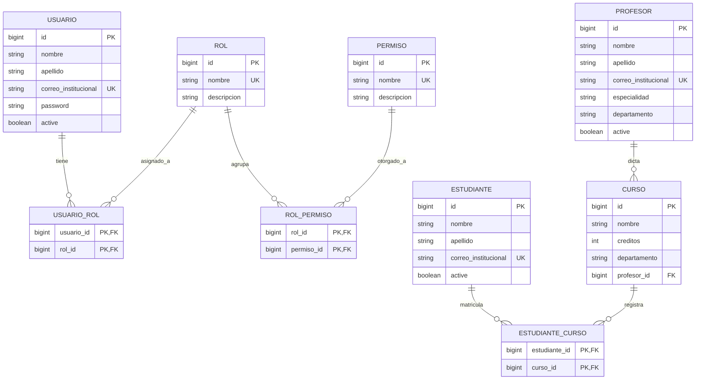

# Modelo Relacional

```mermaid
erDiagram
    USUARIO ||--o{ USUARIO_ROL : tiene
    ROL ||--o{ USUARIO_ROL : asignado_a
    ROL ||--o{ ROL_PERMISO : agrupa
    PERMISO ||--o{ ROL_PERMISO : otorgado_a
    PROFESOR ||--o{ CURSO : dicta
    ESTUDIANTE ||--o{ ESTUDIANTE_CURSO : matricula
    CURSO ||--o{ ESTUDIANTE_CURSO : registra

    USUARIO {
        bigint id PK
        string nombre
        string apellido
        string correo_institucional UK
        string password
        boolean active
    }

    ROL {
        bigint id PK
        string nombre UK
        string descripcion
    }

    PERMISO {
        bigint id PK
        string nombre UK
        string descripcion
    }

    USUARIO_ROL {
        bigint usuario_id PK,FK
        bigint rol_id PK,FK
    }

    ROL_PERMISO {
        bigint rol_id PK,FK
        bigint permiso_id PK,FK
    }

    PROFESOR {
        bigint id PK
        string nombre
        string apellido
        string correo_institucional UK
        string especialidad
        string departamento
        boolean active
    }

    CURSO {
        bigint id PK
        string nombre
        int creditos
        string departamento
        bigint profesor_id FK
    }

    ESTUDIANTE {
        bigint id PK
        string nombre
        string apellido
        string correo_institucional UK
        boolean active
    }

    ESTUDIANTE_CURSO {
        bigint estudiante_id PK,FK
        bigint curso_id PK,FK
    }
```
